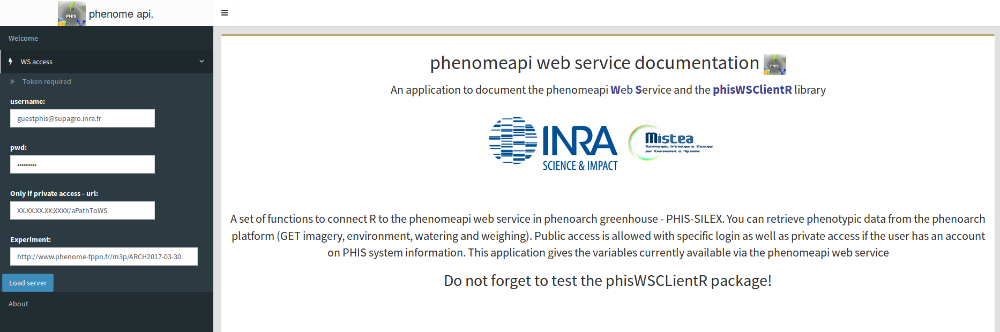

# docAppPhisWSClientR

phenomeapi web service documentation

This application gives the variables currently available via the **phenomeapi web service**.
                    
# Usage

Once the application is installed on your computer, you will have to install the following R packages to make it executable

```R
install.packages("shiny")
install.packages("shinydashboard")
install.packages("shinyjs")
install.packages("DT")
install.packages("phisWSClientR")
```

You can find the phisWSClientR package [here](https://github.com/sanchezi/phisWSClientR).

How to use this documentation App?

* Please click on __WS access__ to scroll down the menu
* Enter a __username, password, a path to the WS__ if you want a __private access__ to the phenomeapi WS
* Keep the default username and password if you want a __public access__ to the WS
* Please, give an __experiment URI__ for which you want to know the available variables
* Click on the __submit button__ each time you change your settings
* You can retrieve the variable names usable in the __phisWSClientR get()__ functions in the __observationVariableId__ colname of each dataset



# Citation

You should cite the **phisWSClientR** package as well as the **shiny** and **shinydashboard** ones:

```R
citation("phisWSClientR")
citation("shiny")
citation("shinydashboard")
```

See also citation() for citing R itself.
